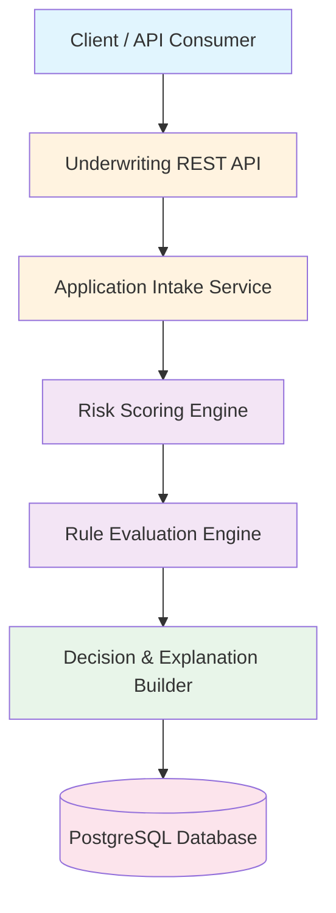
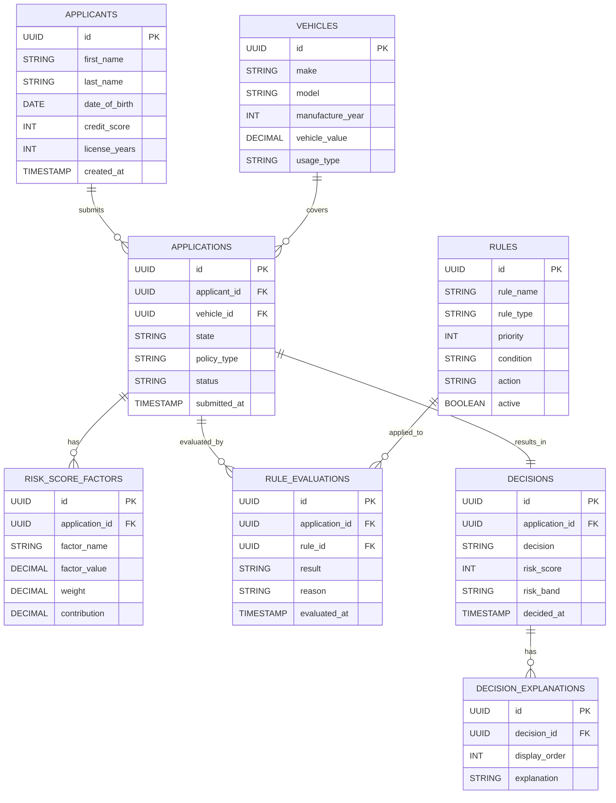
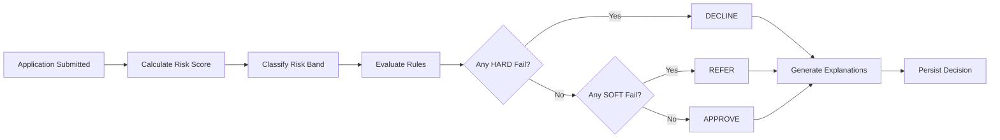

# AegisUnderwrite

**Explainable Auto Insurance Underwriting Engine**

AegisUnderwrite is a backend-focused auto insurance underwriting system designed to model real-world underwriting decision engines used by insurance companies. The application evaluates policy applications using deterministic business rules and quantitative risk scoring to produce clear, explainable underwriting decisions.

The system emphasizes correctness, transparency, and auditability, aligning with regulatory and compliance expectations common in insurance and financial services domains.

---

## Problem Statement

Insurance underwriting systems must evaluate applicant risk accurately while maintaining explainability for regulatory compliance and internal review. Many decision engines become opaque or tightly coupled, making them difficult to audit, extend, or reason about.

AegisUnderwrite addresses this by separating risk scoring, rule evaluation, and decision generation into clearly defined components, producing decisions that are both deterministic and explainable.

---

## Key Features

- Rule-based underwriting decisions (Approve, Refer, Decline)
- Quantitative risk scoring with weighted factors
- Priority-based hard and soft underwriting rules
- Explainable decision output with human-readable reasons
- Full audit trail for applications, scores, and decisions
- Configurable and extensible underwriting logic
- Clean domain-driven backend design

---

## Tech Stack

| Layer | Technology |
|-------|------------|
| Language | Java 17 |
| Framework | Spring Boot 3.5 |
| ORM | Spring Data JPA (Hibernate) |
| Database | PostgreSQL |
| Migrations | Flyway |
| Build | Maven |
| API | RESTful |

---

## High-Level Architecture



---

## Entity Relationship Diagram



---

## Underwriting Decision Flow



---

## Domain Overview

### Core Inputs

| Category | Attributes |
|----------|------------|
| Driver Profile | Age, credit score, license history |
| Vehicle Details | Make, model, year, value, usage type |
| Policy Context | State, coverage type |

### Core Outputs

| Output | Description |
|--------|-------------|
| Risk Score | Quantitative score (0–1000) |
| Risk Band | LOW, MEDIUM, HIGH |
| Decision | APPROVE, REFER, DECLINE |
| Explanations | Human-readable reasons |

---

## Risk Scoring

Risk score is calculated using weighted factors:

| Factor | Weight | Description |
|--------|--------|-------------|
| Credit Score | 30% | Higher score = lower risk |
| License Years | 20% | More experience = lower risk |
| Driver Age | 20% | 25-65 optimal range |
| Vehicle Value | 15% | Lower value = lower risk |
| Vehicle Age | 15% | Newer vehicles = better safety |

### Risk Bands

| Score Range | Band |
|-------------|------|
| 700 - 1000 | LOW |
| 400 - 699 | MEDIUM |
| 0 - 399 | HIGH |

---

## Rule Types

| Type | On Failure | Use Case |
|------|------------|----------|
| **HARD** | Auto-decline | Non-negotiable criteria (underage, credit too low) |
| **SOFT** | Refer to human | Edge cases needing judgment (expensive car, new driver) |

### Default Rules

| Rule | Type | Condition |
|------|------|-----------|
| MIN_DRIVER_AGE | HARD | Age ≥ 18 |
| MIN_LICENSE_YEARS | SOFT | License ≥ 1 year |
| MIN_CREDIT_SCORE | HARD | Credit ≥ 500 |
| MAX_VEHICLE_VALUE | SOFT | Value ≤ $150,000 |
| MAX_VEHICLE_AGE | HARD | Vehicle ≤ 20 years old |
| HIGH_RISK_SCORE | SOFT | Risk score ≥ 300 |

---

## API Endpoints

### Applications

| Method | Endpoint | Description |
|--------|----------|-------------|
| POST | `/api/applications` | Submit new application |
| GET | `/api/applications/{id}` | Get application details |
| POST | `/api/applications/{id}/process` | Trigger underwriting |
| GET | `/api/applications/{id}/decision` | Get decision |
| GET | `/api/applications/{id}/details` | Get full audit details |

### Rules

| Method | Endpoint | Description |
|--------|----------|-------------|
| GET | `/api/rules` | List all rules |
| GET | `/api/rules/active` | List active rules |
| POST | `/api/rules` | Create new rule |
| PATCH | `/api/rules/{id}/toggle` | Enable/disable rule |

---

## Sample Request & Response

### Submit Application

```bash
POST /api/applications
Content-Type: application/json

{
  "applicant": {
    "firstName": "John",
    "lastName": "Smith",
    "dateOfBirth": "1985-06-15",
    "creditScore": 720,
    "licenseYears": 10
  },
  "vehicle": {
    "make": "Toyota",
    "model": "Camry",
    "manufactureYear": 2021,
    "vehicleValue": 28000,
    "usageType": "PERSONAL"
  },
  "state": "CA",
  "policyType": "FULL_COVERAGE"
}
```

### Decision Output

```json
{
  "applicationId": "b7a1e3c2-...",
  "decision": "APPROVE",
  "riskScore": 756,
  "riskBand": "LOW",
  "explanations": [],
  "decidedAt": "2026-01-29T08:00:00Z"
}
```

### Decline Example

```json
{
  "applicationId": "c8b2f4d1-...",
  "decision": "DECLINE",
  "riskScore": 482,
  "riskBand": "MEDIUM",
  "explanations": [
    "Credit score (450) below minimum threshold"
  ],
  "decidedAt": "2026-01-29T08:05:00Z"
}
```

---

## Getting Started

### Prerequisites

- Java 17+
- PostgreSQL 15+
- Maven 3.8+

### Setup

1. **Clone the repository**
   ```bash
   git clone https://github.com/your-org/aegis-underwrite.git
   cd aegis-underwrite
   ```

2. **Create database**
   ```sql
   CREATE DATABASE aegis_underwrite;
   ```

3. **Configure application**
   ```yaml
   # src/main/resources/application.yml
   spring:
     datasource:
       url: jdbc:postgresql://localhost:5432/aegis_underwrite
       username: your_username
       password: your_password
     jpa:
       hibernate:
         ddl-auto: validate
     flyway:
       baseline-on-migrate: true
   ```

4. **Run the application**
   ```bash
   mvn spring-boot:run
   ```

5. **Test the API**
   ```bash
   curl http://localhost:8080/api/rules
   ```

---

## Project Structure

```
src/main/java/com/aegisunderwrite/application/
├── controller/
│   ├── ApplicationController.java
│   ├── RuleController.java
│   └── GlobalExceptionHandler.java
├── service/
│   ├── UnderwritingService.java
│   ├── RiskScoringService.java
│   └── RuleEvaluationService.java
├── repository/
│   ├── ApplicationRepository.java
│   ├── ApplicantRepository.java
│   ├── VehicleRepository.java
│   ├── RuleRepository.java
│   ├── RuleEvaluationRepository.java
│   ├── RiskScoreFactorRepository.java
│   ├── DecisionRepository.java
│   └── DecisionExplanationRepository.java
├── entity/
│   ├── Application.java
│   ├── Applicant.java
│   ├── Vehicle.java
│   ├── Rule.java
│   ├── RuleEvaluation.java
│   ├── RiskScoreFactor.java
│   ├── Decision.java
│   └── DecisionExplanation.java
├── dto/
│   ├── ApplicationRequest.java
│   ├── ApplicationResponse.java
│   ├── DecisionResponse.java
│   └── ...
├── mapper/
│   ├── ApplicationMapper.java
│   ├── DecisionMapper.java
│   └── ...
└── enums/
    ├── ApplicationStatus.java
    ├── DecisionOutcome.java
    ├── RiskBand.java
    └── ...
```

---

## Why This Architecture?

| Principle | Implementation |
|-----------|----------------|
| **Separation of Concerns** | Scoring, rules, and orchestration in separate services |
| **Audit Trail** | Every factor and rule evaluation persisted |
| **Configurability** | Rules in database, not hardcoded |
| **Explainability** | Human-readable reasons for every decision |
| **Extensibility** | Add new rules without code changes |

---

